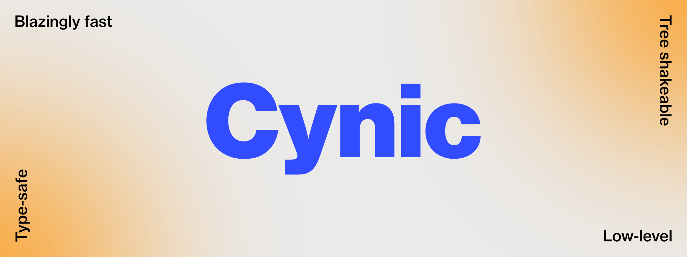

# Cynic



## Installation

```shell
yarn add @yamiteru/cynic
```

## Table of contents

- [Concept](./docs/concept.md)
- [API](./docs/api.md)
- [Modularity](./docs/modularity.md)
- [Benchmark](./docs/benchmark.md)

---

Have a beautiful day 🍀
